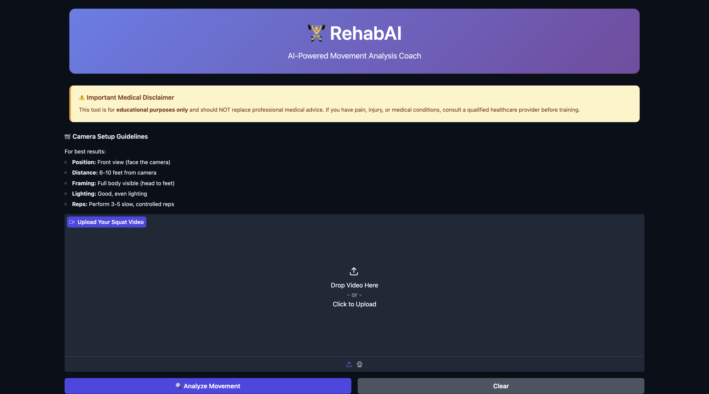
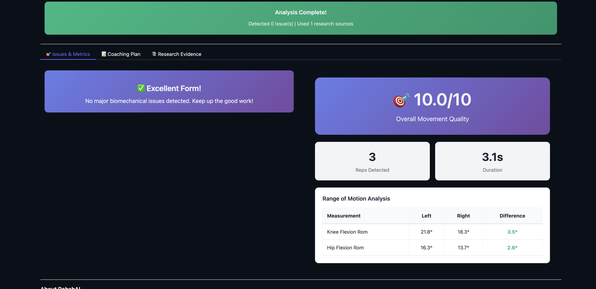
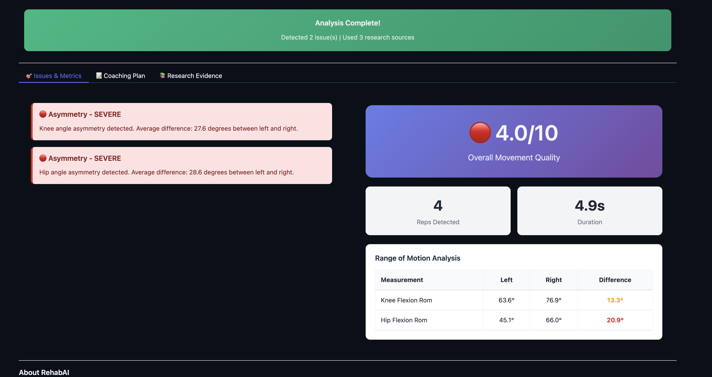
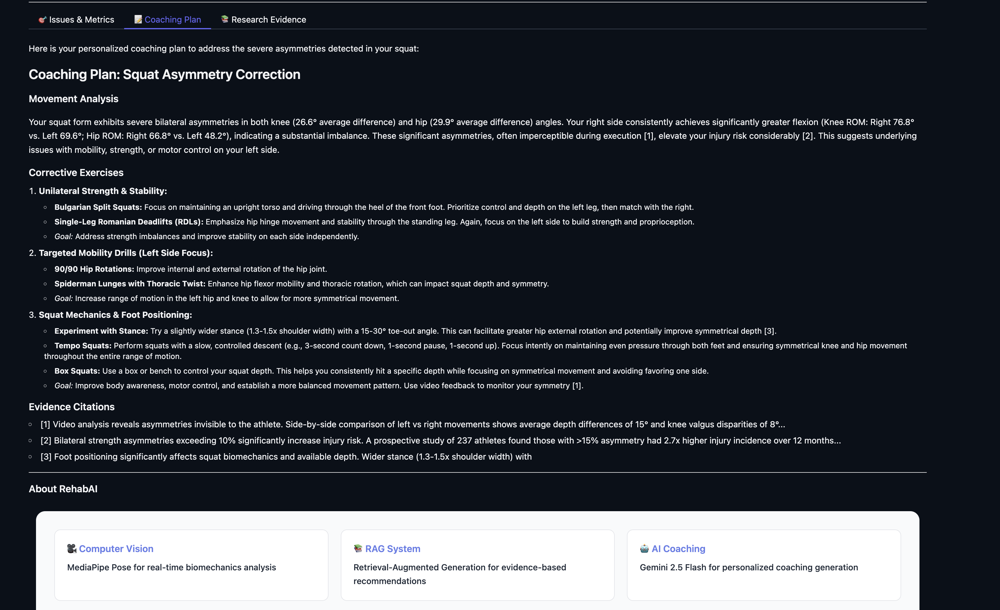

# 🏋️ RehabAI - AI Movement Analysis Coach

<div align="center">


**AI-powered squat analysis using Computer Vision, RAG, and LLM-based coaching**

[](https://www.python.org/downloads/)
[](https://gradio.app/)
[](https://ai.google.dev/)

</div>

---

## 🎯 What It Does

RehabAI analyzes your squat form and provides personalized coaching backed by research literature. Upload a video → Get instant biomechanics analysis → Receive evidence-based corrective exercises.

**Core Pipeline:**
1. **Computer Vision** (MediaPipe) detects pose and calculates joint angles
2. **RAG System** (ChromaDB + Sentence Transformers) retrieves relevant research
3. **LLM Agent** (Gemini 2.5 Flash + LangGraph) generates personalized coaching

---

## 🖼️ Screenshots

| Home Interface | Analysis Results (Good Form) |
|:--------------:|:----------------------------:|
|  |  |

| Analysis Results (Issues Detected) | AI Coaching Plan |
|:----------------------------------:|:----------------:|
|  |  |

---

## 🏗️ Architecture

```mermaid
graph TD
    A[Gradio Web UI] --> B[LangGraph Orchestrator]
    B --> C[MediaPipe Pose]
    B --> D[ChromaDB RAG]
    B --> E[Gemini 2.5 Flash]
    C --> F[Biomechanics]
    D --> G[Research Evidence]
    E --> H[Coaching Plan]

Tech Stack:

CV: MediaPipe Pose

RAG: ChromaDB + Sentence Transformers (all-MiniLM-L6-v2)

LLM: Google Gemini 2.5 Flash

Orchestration: LangGraph

UI: Gradio 4.0

🚀 Quick Start
Installation

# Clone and setup
git clone https://github.com/yourusername/RehabAI.git
cd RehabAI
python -m venv venv
source venv/bin/activate  # Windows: venv\Scripts\activate
pip install -r requirements.txt

# Add API key
echo "GOOGLE_API_KEY=your_key_here" > .env

Run
python app.py
